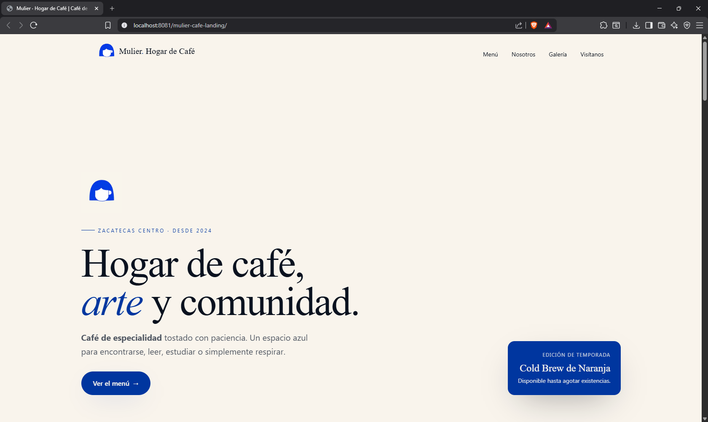
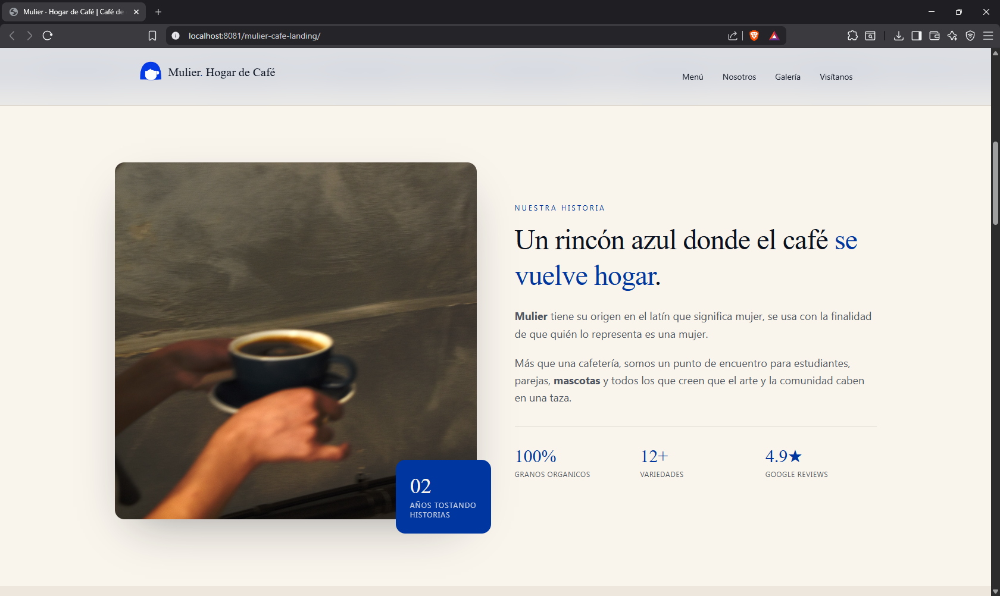
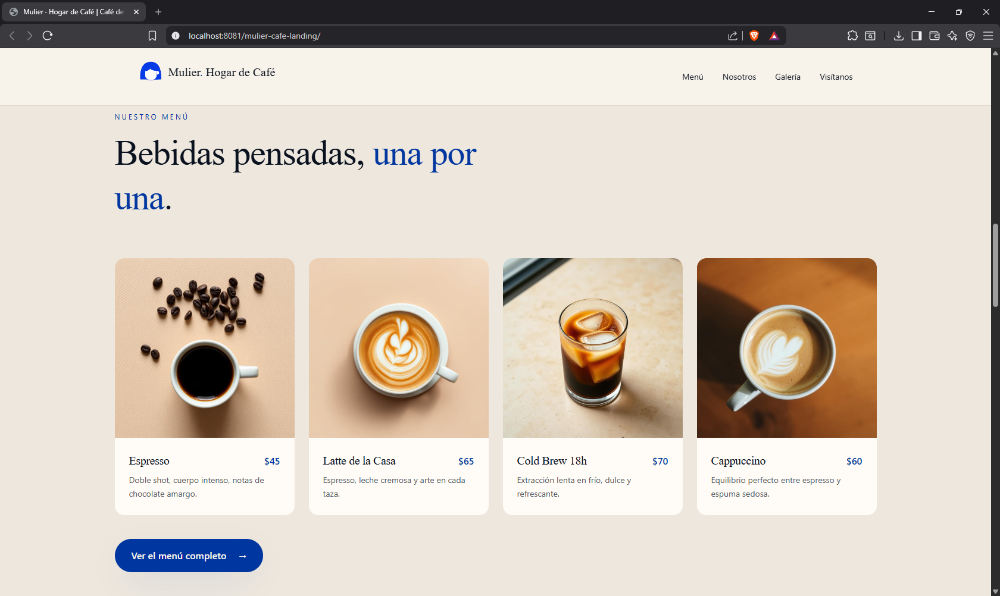
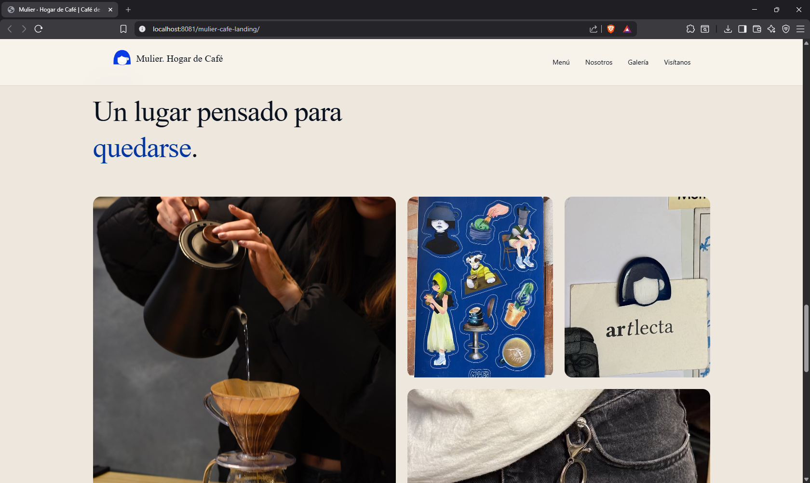
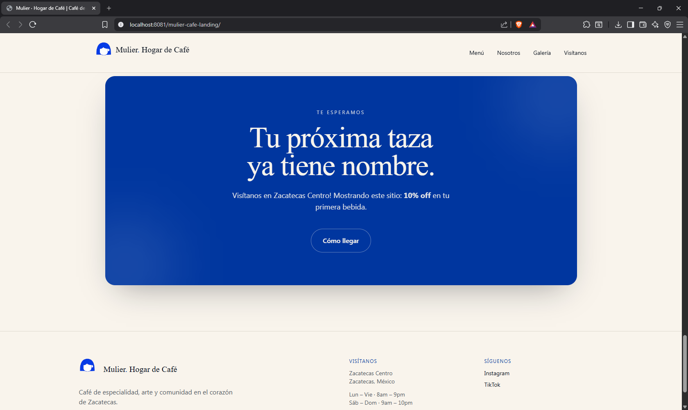
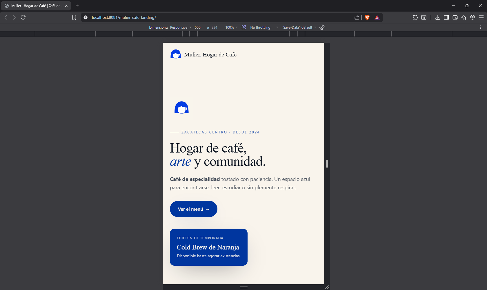

# Mulier Café Landing Page

A modern and visually immersive landing page designed for **Mulier · Hogar de Café**, a specialty coffee shop located in Zacatecas Centro. The project focuses on storytelling, brand identity, and user experience through smooth animations, responsive design, and elegant visual presentation.

---

## Features

* Modern coffee shop landing page
* Responsive design for desktop and mobile
* Smooth scrolling with Lenis
* Animated hero section
* About section
* Featured menu section
* Customer testimonials
* Image gallery
* Call-to-action section
* Custom branding and visual identity
* SEO-friendly metadata
* Fast static deployment

---

## Tech Stack

* React
* TypeScript
* Vite
* TanStack Router
* Tailwind CSS
* Lenis
* Radix UI
* Lucide React

---

## Screenshots

### Home Section


### About us Section


### Menu Section


### Gallery


### Visit us Experience


### Mobile Experience


---

## Sections

### Hero

A full-screen hero section featuring:

* Brand identity
* Coffee shop imagery
* Main value proposition
* Smooth visual transitions

### About

Introduces the story and philosophy behind Mulier.

### Menu

Showcases featured specialty coffee products:

* Espresso
* Latte
* Cappuccino
* Cold Brew

### Testimonials

Highlights customer experiences and social proof.

### Gallery

Displays the atmosphere, products, and café experience through photography.

### Call To Action

Encourages visitors to visit the café and engage with the brand.

---

## How to Run

### Clone the repository

```text
git clone https://github.com/1affogato/mulier-cafe-landing.git

cd mulier-cafe-landing
```

### Install dependencies

```text
npm install
```

### Start the development server

```text
npm run dev
```

### Open

```text
http://localhost:5173
```

---

## Build for Production

```text
npm run build
```

Preview production build:

```text
npm run preview
```

---

## Project Structure

```text
mulier-cafe-landing/

│
├── src/
│
├── assets/
│   ├── hero-coffee.jpg
│   ├── barista.jpg
│   ├── gallery-*.jpg
│   ├── menu-*.jpg
│   └── logos
│
├── components/
│   ├── ui/
│   └── shared components
│
├── hooks/
│   ├── use-lenis.ts
│   └── use-mobile.tsx
│
├── routes/
│   ├── __root.tsx
│   └── index.tsx
│
├── styles.css
│
├── vite.config.ts
│
└── package.json
```

---

## Architecture

```text
User Visit
      │
      ▼
 TanStack Router
      │
      ▼
 Landing Page Sections
      │
 ┌────┼─────┬─────┬─────┐
 ▼    ▼     ▼     ▼     ▼
Hero About Menu Gallery CTA
      │
      ▼
 Smooth Scrolling (Lenis)
      │
      ▼
 Responsive UI
      │
      ▼
 Brand Experience
```

---

## Design Goals

* Premium specialty coffee branding
* Fast loading performance
* Mobile-first experience
* Strong visual storytelling
* Clean and modern aesthetics
* High conversion landing page structure

---

## Future Improvements

* Online reservations
* Interactive menu
* Google Maps integration
* Instagram feed integration
* Contact form
* Newsletter subscription
* Multi-language support
* CMS integration
* Analytics dashboard

---

## Inspiration

The project was created as a modern digital presence for a specialty coffee shop, emphasizing coffee culture, community, and design through a contemporary web experience.
